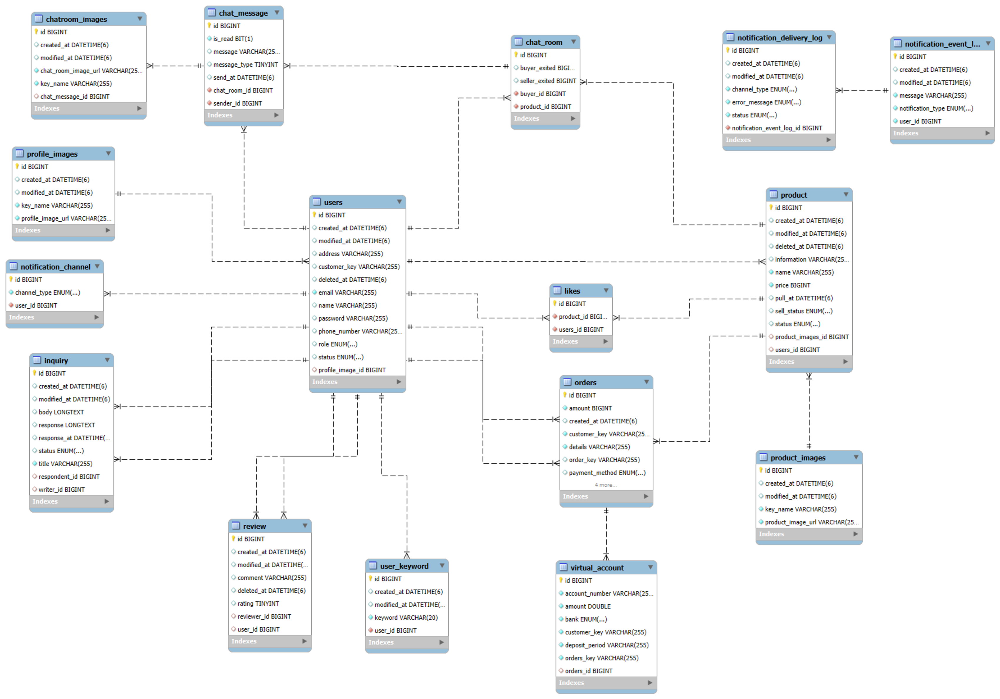
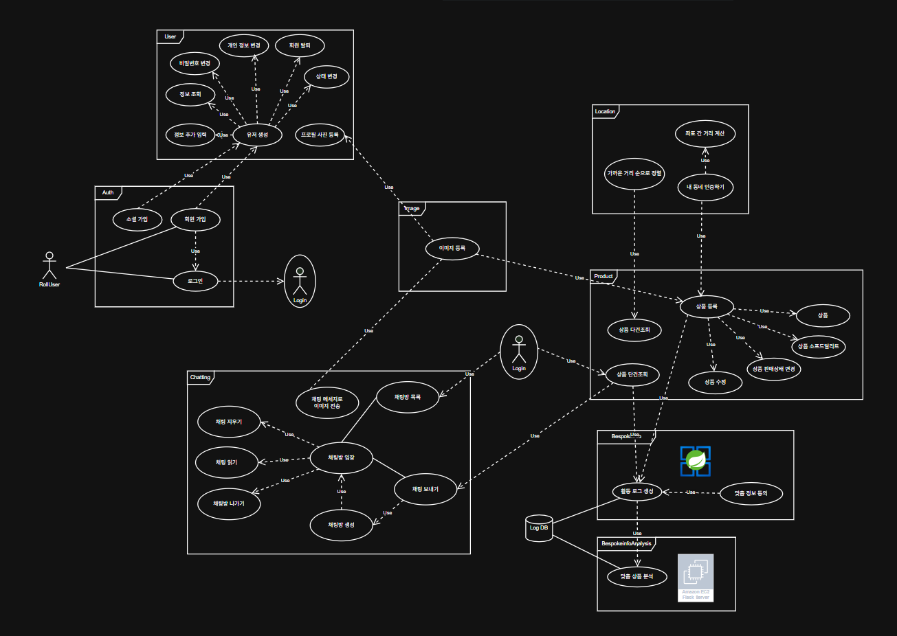
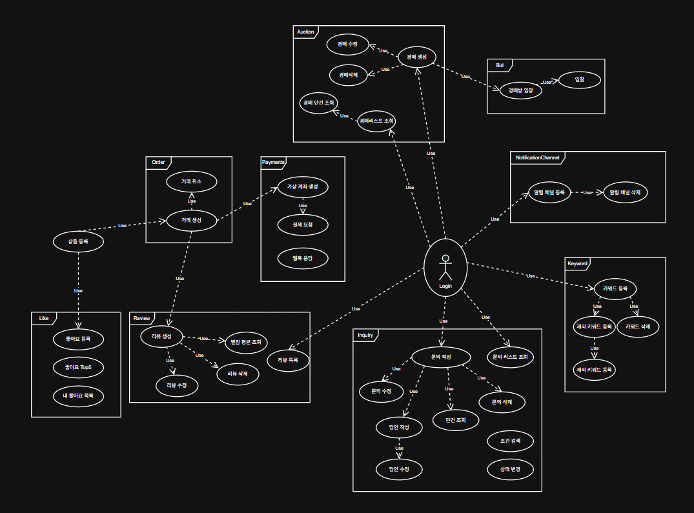
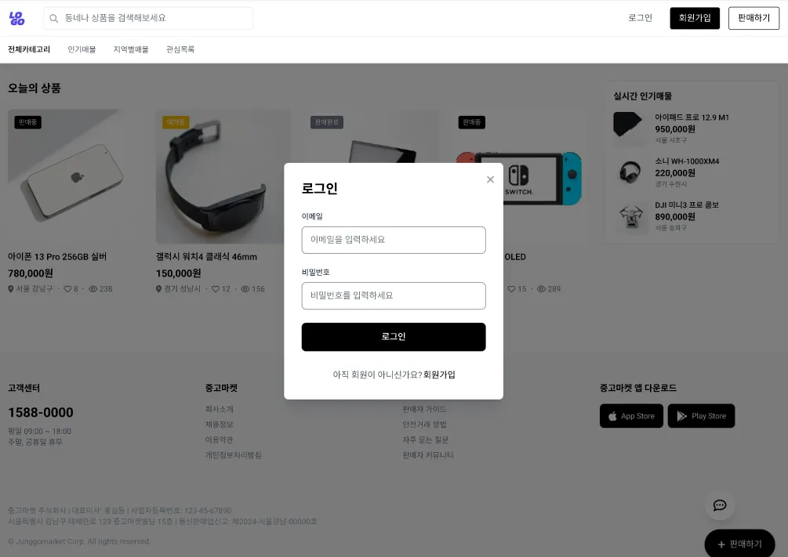
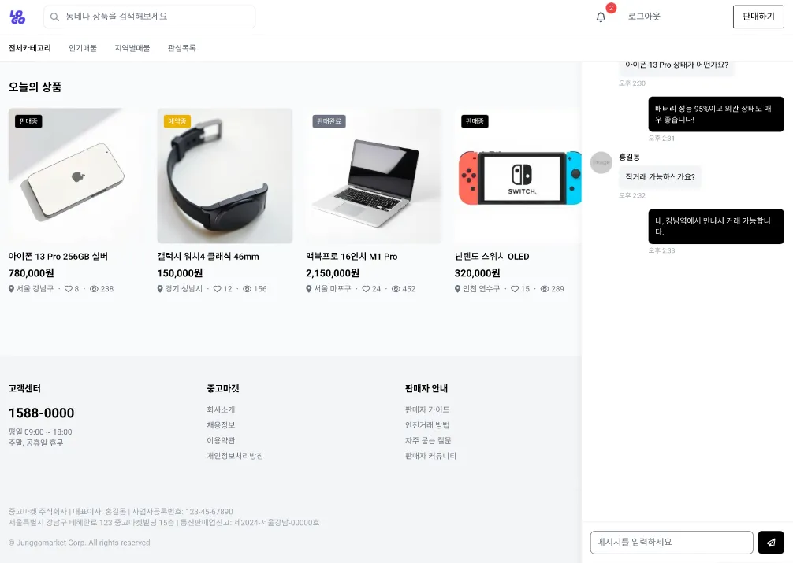
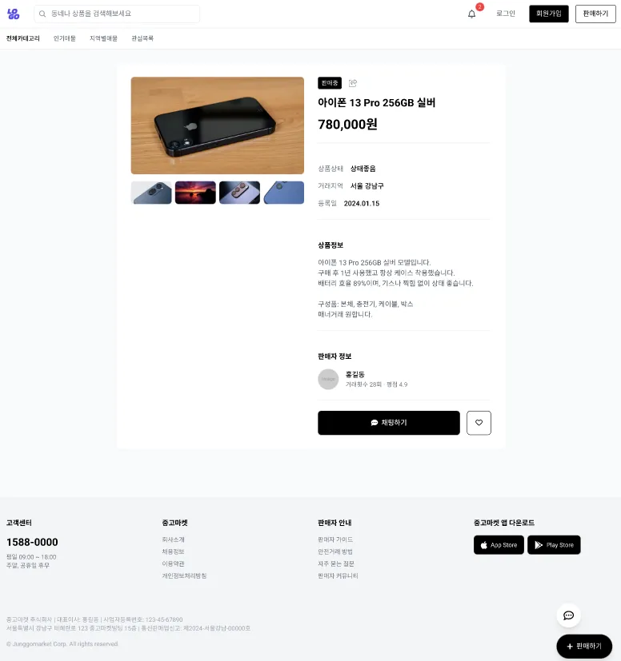

## 👉🏼 [내일배움캠프] 최종 프로젝트 12조

### 🙋‍♀️ 실시간 채팅 기반 중고 거래 플랫폼
- **팀원 : 김형우, 권은서, 남윤재, 황제, 황보승**
- 기간 : 2025.04.01 - 2025.05.06


<br><br>

### 역할 분담
🐯 [khw00185](https://github.com/khw00185) <p>　　- WebSocket Stomp + Redis + Redis Pub/Sub으로 실시간 채팅 구현 <br>　　- RabbitMQ + Redis를 통해 경매 서비스 구현 <p><br>
🦅 [euuns](https://github.com/euuns) <p>　　- Spring Security + OAuth2.0 소셜 로그인 <br>　　- Toss Payments 연동 결제 시스템 <br>　　- jacoco를 통한 테스트 자동화 시각처리 <br>　　- github action을 이용한 EC2 배포 <p><br>
🐶 [yjn33](https://github.com/yjn33) <p>　　- 상품 기능 및 끌어올리기 구현 <br>　　- Random Forest 알고리즘을 이용한 사용자 기반 맞춤 추천 구현 <p><br>
👑 [JeisaNewbie](https://github.com/JeisaNewbie) <p>　　- 다양한 도메인에 사용 가능한 알림 서비스 구현 <br>　　- Elastic Search를 통한 검색 기능 향상 개선 <p><br>
🐹 [emily101304](https://github.com/emily101304) <p>　　- S3를 활용한 이미지 업로드 구현 <br>　　- CloudFront를 활용하여 CDN 연동 <br>　　- KakaoMap API를 활용한 GeoCoding <br>　　- MySQL GIS 기반 거리 계산 기능 구현 <p><br>


<br>

📑 진행 및 회의 기록 : [12조: 중고 천국(Jung-Go Heaven)](https://www.notion.so/teamsparta/12-Jung-Go-Heaven-1ce2dc3ef514814cbeebce87baafa56d) 노션 <br>
🔖 브로셔 페이지 : [12조: 중고 천국(Jung-Go Heaven)](https://www.notion.so/teamsparta/12-1e32dc3ef514807fbf2bce8559c3aaac) 노션


<br><br><br>


## 🛠 목차

1. [📚 STACKS](#-STACKS)
2. [🏗️ System Architecture](#-System-Architecture)
3. [🖼️ 와이어 프레임](#-와이어-프레임)
4. [🔧 기술적 의사결정](#-기술적-의사결정)
5. [💥 트러블슈팅](#-트러블슈팅)
<br>   

<br><br><br>

<div align=center> 

## 📚 STACKS

#### Backend, Analysis & Optimization
 
 


<br>


<br><br>

#### Other Tools


<br>


<br><br>

#### Deployment & Distribution 


<br>


<br><br><br><br>

<div align=left> 

## 🏗️ System Architecture

### Infra Architecture

<div align=center> 


<div align=left> 

### ER Diagram

<div align=center> 



<div align=left> 

### Usecase

<div align=center> 




<div align=left> 

## 🖼️ 와이어 프레임





## 🔧 기술적 의사결정

<details>
<summary >외부 API 중 KakaoMap API를 선택한 이유</summary>
<div markdown="1">

- Google Map API
- Naver Map API
- Kakao Map API

외부 API 중 KakaoMap API를 선택한 이유

- **Google Map API :** 전 세계적으로 통용. 국내 지번 주소 인식을 잘 못하는 문제 발생
- **Naver Map API :** 국내 맵을  정교하게 다룸. 특히 모바일 SDK에서 강함. 파싱하기 까다로운 구조로 API 제공
- **Kakao Map API :** 네이버에서 제공하는 기능과 큰 차이 없음. 접근성이 상대적으로 쉬움. JavaScript 기반으로 커스텀 가능

> 결론 : 접근성이 용이하고 기능 구현에서 파싱 문제가 최소화된 KakaoMap API를 선정
>

</div>
</details>

<details>
<summary >WebSocket 통신만 사용하다가 왜 Redis Pub/Sub을 적용하게 되었는지</summary>
<div markdown="1">

### 1. 배경

초기 채팅 서비스와 경매 입찰 서비스 모두 단일 서버 기반에서 WebSocket 통신만으로 브로드캐스트 기능을 처리 함. 이 구조는 단일 서버 환경에서는 간단하고 효율적이었지만, 서버를 스케일아웃하거나 다중 인스턴스로 확장할 경우에는 **WebSocket 세션 정보가 서버 간 공유되지 않아 브로드캐스트 메시지 전달에 한계**가 있음.

우리 팀은 프로젝트 고도화를 고려해 MSA 구조로의 전환 가능성을 염두에 두었고, 이에 따라 **서버 간 메시지 전달이 가능한 Redis Pub/Sub 구조로의 전환**을 추진.

### 2. 요구사항

- 서버가 수평 확장되어도 채팅 및 경매 브로드캐스트 기능이 정상 작동해야 함
- DTO를 포함한 메시지를 안정적으로 직렬화하여 전송할 수 있어야 함

### 3. 고려한 대안

| 방식 | 장점 | 단점 |
| --- | --- | --- |
| WebSocket 단독
| 간단한 구조, 낮은 지연시간 | 서버 확장 시 세션 관리 어려움, 브로드캐스트 불가 |
| Kafka | 강력한 확장성, 내구성 | 설정 복잡도가 높고 오버스펙 |
| Redis Pub/Sub | 설정 간단, 실시간성 우수, 수평 확장 가능 | 메세지 유실 방지 기능 없음(단순 브로드캐스트에 적합) |

→ 프로젝트의 **실시간성과 간단한 수평 확장**에 초점을 맞춰 Redis Pub/Sub을 채택함

### 4. 구현 전략

- Redis Pub/Sub 구조를 도입하여 메시지를 브로커 기반으로 전달
- 서버 간 상태 공유 없이 채널 기반으로 메시지를 전달함으로써 확장성 확보
- 메시지를 Redis에 publish하고, 이를 각 서버의 subscriber가 수신 후 WebSocket으로 전달
- DTO 직렬화는 GenericJackson2JsonRedisSerializer를 사용하여 Java 8 LocalDateTime 등도 호환 가능하게 처리

### 5. **구현 상세**

• 입찰, 메세지 전송 요청 시 DTO를 Redis 채널 "auction.broadcast", "chat.message”에 publish
예시)

`redisTemplate.convertAndSend(channel, message);`

• 각 서버는 RedisMessageListenerContainer를 통해 해당 채널을 구독하며, 메시지를 수신하면 SimpMessagingTemplate을 사용해 WebSocket 브로드캐스트 수행

예시)

`messagingTemplate.convertAndSend("/sub/auctions/" + dto.getAuctionId(), dto);`

### 6. 회고 및 향후 고려사항

- 현재는 단일 서버 구조이므로 Redis Pub/Sub의 효과는 제한적이지만, 다중 서버 환경으로 이관 시 무중단 확장이 가능하도록 구조를 선제적으로 확보한 상태
- 추후 서버 간 메시지 유실 방지가 중요한 경우 Redis Streams, Kafka 등의 메시지 큐 도입도 고려 가능
- 성능 테스트는 JMeter 기반 부하 시나리오로 검증하였으며, 1000 스레드가 100회씩 요청 시도하는 스파이크 테스트에서 안정적으로 브로드캐스트가 수행됨

</div>
</details>

<details>
<summary>알림 기능에 EventListener 를 사용한 이유</summary>
<div markdown="1">

1. **배경**

   현재 "중고천국" 에플리케이션의 아키텍쳐 구조는 Monolithic Architecture.

   하지만 초기 개발 단계에서 추후 MSA 혹은 알림 서비스의 분리를 고려하였음.

2. **요구사항**
    - 낮은 결합도: 추후 알림 서비스의 분리 때문에 최대한 결합도를 낮추어야 함.
    - 적은 코드 변경: 최종적으로 Kafka 의 Pub / Sub 방식으로의 전환에 있어서 코드 변경이 적어야 함.
    - 기능 확장성: 다양한 도메인에서의 사용, 다양한 알림 채널 전송 방식으로 인해 확장이 쉬워야 함.

3. **고려한 대안**


    | 비교 항목 | EventListener | Service |
    | --- | --- | --- |
    | 결합도 | 낮음 | 높음 |
    | 코드 변경 | 낮음 | 높음 |
    | 기능 확장성 | 높음 | 높음 |
4. **결정 및 근거
   ✅**EventListener 선택 & 이유

1. Service Layer 방식으로 알림 서비스를 개발 할 경우, 다른 도메인과의 결합도가 매우 높아짐.
   알림 서비스를 사용할 도메인은 의존성을 주입 받아야 하고, 알림 서비스 역시 다른 도메인을 의존해야 함.

2. EventListener 방식으로 개발 할 경우, 다른 도메인에서 EventListener → Kafka 변경시 코드의 수정이 거의 없으리라 예상합니다. 이는 EventListener 와 Kafka 가 Pub / Sub 방식으로 동작하기 때문.
5. 알림 서비스 다이어그램

   

</div>
</details>

<details>
<summary>여러 PG사 중 왜 하필 Toss Payments를 선택했는지</summary>
<div markdown="1">

## **✅ Toss, Virtual Account 선택 이유**

결제 기능을 구현 시 동작 순서에 대한 주요 흐름

1. 요구 사항 정리
2. 결제 서비스 종류 — 카드, 계좌 이체, 간편 결제 등
3. 결제 대행 PG 선택 및 연동 방식 이해
4. Spring Boot로 BE 기능 구성
5. 테스트 결제 구현

---

## PG 종류

- **Iamport (portone)**
    - 다양한 결제 수단 통합 관리 가능
    - 기본적인 결제 flow 이해에 도움
    - UI 없이 빠르게 연동 가능

- **KG Inicis**
    - 높은 안정성 보유, 전자 결제 시장 점유율 上
    - Hash서명, CallBak 처리 등 보안 개념을 익히는 데 큰 도움
    - 직접적인 PG 연동 경험 가능

- **Toss Payments**
    - 최신 PG사 연동 경험 보유 가능
    - 공식 문서가 깔끔하며 편리한 테스트 환경 제공
    - Webhook 설계 스킬 경험 가능

- **NHN KCP**
    - 안정성이 최우선인 대규모 서비스
    - 오랜 업력으로 높은 시장 점유율 보유

- **NICE Payments**
    - 온/오프라인 결제 통합이 가능하며 다양한 결제 수단 지원

---

## 결제 서비스

- **신용 카드 결제, 간편 결제**
    - 사용자 인증 - 비밀번호, 생체 인증 등
    - 보안을 위한 사용자 디바이스가 필요할 수 있음

- **백 오피스 결제, 관리자 직접 결제**
    - PG 서버 - 내 서버 통신 처리
    - 무통장 입금, 가상계좌, 계좌 이체 등에서 사용

- **비 인증 결제, 자동 결제**
    - 결제 수단을 미리 저장
    - 저장된 결제 token을 이용해 자동 결제 처리

*※ 위 내용은 단순 조사 내용으로 실제 시장과 다를 수 있으며, 대부분의 회사에서 다양한 결제 시스템, 문서, 기술 제공 중*

---

# **✅** 선택 이유

우리 팀의 프로젝트는 '실시간 채팅 기반 중고 거래 시스템'를 구현하는 것이었고, '중고 거래' 특성 상 가장 중요한 건 '사기'에 대한 위험

**`중고나라`**, **`당근마켓`**, **`번개장터`** 등등 각 플랫폼마다 안전하게 거래를 할 수 있는 [안전 거래] 시스템이 존재

**`당근페이`**, **`번개페이`** 등 각 플랫폼에서 인증해주는 전용 페이 시스템도 존재

일반 사업자와 거래보다 더 사기의 위험성이 높은 중고 거래는 사용자들에게 안전성을 보장이 최우선

우리 플랫폼에 [결제 시스템]이 도입된다면 사용자들 간 **직접 계좌 이체로 발생하는 문제**를 최소화할 수 있는 가능성 제시

---

가장 최근에 떠오르기 시작한 회사이며 문서 정리가 깔끔한 토스 선택

- 기본적인 flow를 먼저 알기 위해서는 Port one(Iamport)
- 제대로 보안 기능을 공부하며 구현하기 위해서는 KG이니시스

**→ 외부에서 정보를 받아 REST API 방식으로 간편하게 사용하기 위해 토스 선택**

<aside>


결제 흐름은 **구현에 직접 들어가기 전**, 그리고 **구현을 하는 과정**에서 알아가기로 하였다.

처음부터 큰 욕심을 내지 않고 `webhook`에 대해 알아보며 그 흐름을 익히고, `CallBack`으로 넘어가며 과정에 익숙해지고자 하였다.

</aside>

현재 구현할 수 있다고 판단되는 [가상 계좌]를 선택

가상 계좌 사용 시 **[에스크로]를 사용하면 [토스 페이먼츠]에서 에스크로 대금 보관** 가능

자사 플랫폼에서 에스크로 대금을 보관하는 경우 법적인 조치 필요

PG사에서 에스크로 대금을 보관 시 간편한 구현 가능

→ `에스크로`의 경우, **실제 사업자 등록번호를 입력**해 계약을 해야 사용 가능하여 적용 실패

</div>
</details>


## 💥 트러블슈팅

<details>
<summary>MySQL GIS를 사용하려면 공간 데이터 타입으로 변환 필수</summary>
<div markdown="1">

## ♠️ 배경 설명

- 외부 API인 Kakao Map API와 MySQL GIS을 활용한 위치 기반 서비스 구현
- 기존 Kakao Map API는 위도 및 경도를 **실수값**으로 반환
- KakaoMap API 반환 데이터 예시

    ```json
    "data": {
            "longitude": 126.901347294861,
            "latitude": 37.5567856576915
        }
    ```

- MySQL GIS는 ‘**공간 데이터 타입**’ 을 사용함(실수값 만으로는 거리 계산 불가)

## ♠️ 문제점

### 1. 실수값으로 반환된 위도/경도 데이터를 어떻게 사용할 수 있을까

### 2. ‘공간 데이터’ 라는 것은 무엇이며, 어떻게 변환해서 사용하는가

## ♠️ 해결 방법

### 1. 카카오맵에서 받은 위도/경도는 어떻게 사용할 수 있을까?

카카오맵 API는 보통 `latitude`(위도), `longitude`(경도)를 실수값으로 전달함

이걸 MySQL에 저장하거나 쿼리에서 쓰려면 **`Point` 객체로 변환**이 필요

**`Point` 객체로 변환 후, DB에 저장하여 거리 계산에서 활용 가능**

- 변환 방법 예시

    ```java
    import org.locationtech.jts.geom.Point;
    import org.locationtech.jts.geom.GeometryFactory;
    import org.locationtech.jts.geom.Coordinate;
    
    GeometryFactory geometryFactory = new GeometryFactory();
    Point point = geometryFactory.createPoint(new Coordinate(longitude, latitude));
    ```


### 2. MySQL GIS는 "공간 데이터 타입"을 사용함

MySQL은 GIS(Geographic Information System)를 지원하기 위해 ‘공간 데이터 타입(Spatial Data Types)’을 제공

대표적인 타입은:

- `POINT`: 하나의 위치 (위도, 경도) - 이번 프로젝트에서 사용한 방법
- `LINESTRING`: 선 (경로)
- `POLYGON`: 다각형 (예: 영역, 구역)

이러한 타입들은 단순히 숫자가 아니라 **지리적 의미를 내포한 데이터 타입을 말함**

### 3. 공간 함수들은 공간 타입(`POINT`, `POLYGON` 등)만 인식함

MySQL의 GIS 함수들, 예를 들면:

- `ST_Distance_Sphere(point1, point2)`
- `ST_Contains(polygon, point)`
- `ST_Within(point1, polygon)`

이 함수들은 내부적으로 **지리 수학 계산**을 하기 때문에 `DOUBLE` 타입의 `latitude`, `longitude` 컬럼이 아니라, **`POINT` 형식**의 공간 데이터를 필요로 함.

- 잘못된 사용 예시

    ```java
    //latitude와 longitude가 그냥 숫자 타입이면
    ST_Distance_Sphere(latitude, longitude, ...) //오류 또는 잘못된 결과
    
    ```

</div>
</details>

<details>
<summary>Toss Payments 연동 시 orderId 중복 문제 발생</summary>
<div markdown="1">

### 1. 문제

```java
{
  "code": "FAILED_INTERNAL_SYSTEM_PROCESSING",
  "message": "[P015] 요청정보가 이전 거래정보(은행,금액,예금주명,주민등록번호)와 상이하여 처리결과를 확인할수 없습니다.<BR>이전 거래정보를 확인하시고 재확인하십시오#"
}
```

첫번째 요청임에도 불구하고 ‘이전 거래 정보와 상이’하다는 콜백이 도착

### 2. 원인 분석

```java
Map<String, Object> payload = Map.of(
			"amount", order.getAmount(),
			"orderId", order.getId(),
			"orderName", order.getDetails(),
			"customerName", order.getBuyer().getName(),
			"customerEmail", order.getBuyer().getEmail(),
			"customerMobilePhone", order.getBuyer().getPhoneNumber(),
			"bank", Banks.of(bank).getCode(),
			"useEscrow", true,
			"successUrl", "http://localhost:8080/api/v1/payment/virtual/success",
			"failUrl", "http://localhost:8080/api/v1/payment/virtual/fail"
		);
```

위 코드는 toss에게 넘겨주는 값의 상태로 `orderId`에 order의 `Long타입 id`  전달 중

toss 서버 내에서 각 결제 건에 대한 구분을 `orderId`로 진행 → `orderId`가 단순 숫자라면 구분할 수 없는 것 같다고 추측

<aside>


실제로 DB에서 `key`를 관리할 때 보안을 위해 외부에 넘겨주는 값을 id 자체로 하지 않고 `UUID`를 사용한다는 정보를 얻게 되었다. 구매자를 구분하기 위한 `customerKey`를 UUID로 만들었던 것처럼 `orderId` 역시 UUID로 만들어 보게 되었다.

</aside>

orderKey라는 필드를 추가해 UUID로 변경 시도

### 3. 해결 과정

```java
	@PostPersist
	public void generateOrderKey() {
		if (this.orderKey == null && this.id != null) {
			this.orderKey = UUID.nameUUIDFromBytes(("order-" + this.id).getBytes()).toString();
		}
	}
```

insert가 실행 된 후, 자동으로 실행될 수 있도록 `@PostPersist`를 이용해 `orderKey` 작성

`orderKey`가 **null인 경우**, 그 id를 이용해 `UUID`를 생성

<aside>


여기서 이름을 `orderKey`로 한 이유는 **order의 PK** `id`와 헷갈리지 않기 위함이었다.

**토스 서버에 전달되는 값의 이름은 orderId**지만, 그대로 orderId라고 작성하게 될 경우, order.id와 착각해 다른 값이 전달될 수 있다고 생각 되었다.

같이 UUID로 생성한 user의 `customerKey`와 **네이밍을 동일**하게 하여 orderKey라는 이름으로 생성하였다.

</aside>

### 4. 결과


토스 페이먼츠 개발자 센터에서 API로그를 확인 `500Error` → `200OK`


기존 order의 Long id (`1,2,3,4,…`) 로 전달되던 orderId를 order의 orderKey(`UUID로 생성`)을 넣어주어 정상 처리에 성공

*우리 DB에서는 orderKey지만, 토스에 전달할 때는 orderId라는 이름으로 변경


</div>
</details>

이 외 다양한 의사결정 및 트러블 슈팅, 구현 과정은 브로셔에 정리
